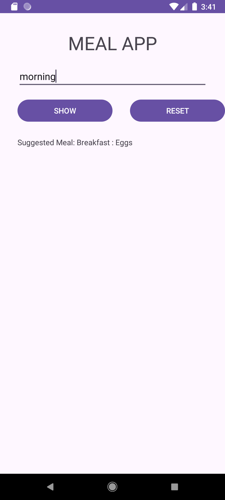
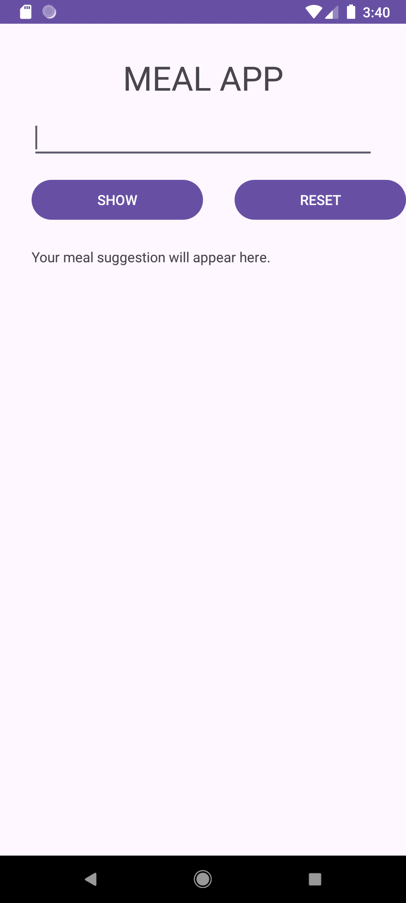

# IMADASSIGNMENT
Name:Phomelelo Tau
ST:ST10492650

Github link: https://github.com/P6000/IMADASSIGNMENT.git

YouTube Video:https://youtu.be/uJWk434B89A?si=5Gpfp18DKQUuzsor

Purpose of the App:

The Meal Suggestion app is designed to assist users in selecting meals based on the time of day. The app simplifies the decision-making process for users, who struggle to determine what to eat during busy days. Users can enter the time of day and the app will suggest appropriate meals for the morning,mid-morning,aternoon,etc. The objective is to create an engaging user experience while providing meaningful meal options quickly.

Key Features:

1.User Input: Users can input the time of day to receive meal suggestions.

2.Meal Suggestions: The app provides a meal suggestions based on the specified time.

3.Reset Functionality: A reset button clears input fields and meal suggestions.

4.Error Handling: Users receive feedback when they enter invalid inputs.

Pictures:
 
